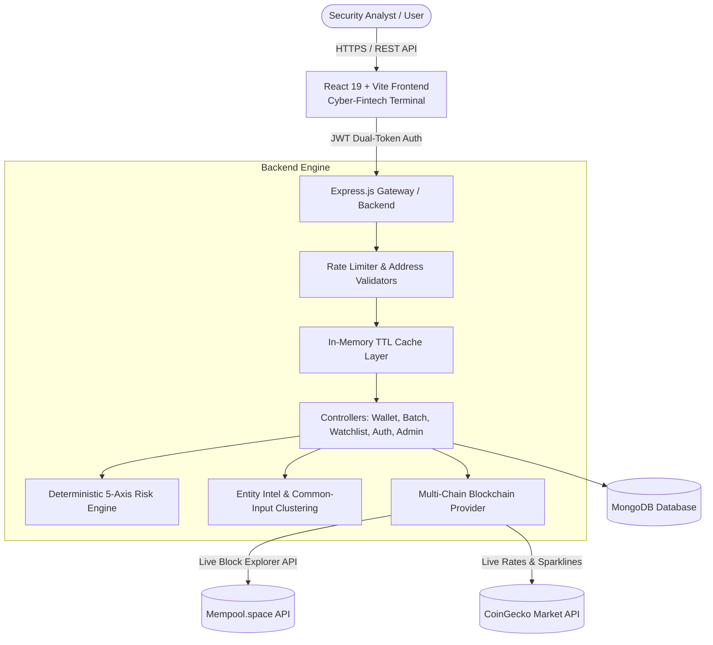

# 🛡️ CryptoScope AI (v2.0)

### Enterprise Blockchain Intelligence & Deterministic Wallet Risk Platform

**CryptoScope AI** is a portfolio-grade Bitcoin blockchain risk analysis platform designed with a dark, cyber-fintech terminal aesthetic. It provides deterministic 5-axis heuristic risk scoring, interactive fund flow network graphing, multi-address batch scanning, known-entity intelligence, common-input clustering heuristics, and automated watchlist monitoring.

---

## 🏛️ System Architecture



---

## 🌟 Core Features

### 🔍 1. Multi-Dimensional Wallet Deep-Dive
- **Deterministic 5-Axis Risk Engine**: 100% explainable, rule-based heuristic scoring calibrated to naturally sum to exactly 100 points:
  1. *Transaction Velocity Risk* (Max 20 pts) — Evaluates lifetime TX volume, burst rates, and priority fee urgency.
  2. *Balance Concentration Risk* (Max 15 pts) — Evaluates capital concentration, mega-whale reserve status, and fund drain ratios.
  3. *Fund Churn / Transit Pattern Risk* (Max 20 pts) — Analyzes pass-through turnover, 1:1 transit turnover, and unidirectional flow imbalance.
  4. *Activity & Temporal Consistency Risk* (Max 15 pts) — Inspects wallet age, activity intensity, and common-input cluster co-spending.
  5. *Entity & Sanctions Exposure Risk* (Max 30 pts) — Flags OFAC SDN designated targets, darknet tumblers, CoinJoin coordinators, and direct mixer counterparties.
- **Animated Speedometer Risk Gauge**: Radial SVG meter with 0–100 score and unified Low (<40) / Medium (40-69) / High (>=70) classification.
- **5-Axis Radar Chart**: Normalized exposure polygon comparing risk vectors.
- **Explainable Security Assessment**: Transparent rule audit detailing active rule IDs (e.g. `RULE-PAT-01`), exact metric thresholds, severity badges, and remediation advice.

### 🕸️ 2. Fund Flow Network Graph & Heuristics
- **Interactive Node-Link Graph**: SVG visualizer displaying target wallet, inbound counterparties, outbound destinations, and transaction weight routing with zoom/pan controls.
- **Known-Entity Tagging**: Curated registry matching exchange hot/cold wallets (Binance, Coinbase, Kraken), privacy mixers (Wasabi CoinJoin, Blender, ChipMixer), threat actors (WannaCry, Mt. Gox exploit), and mining pools.
- **Common-Input-Ownership Clustering**: UTXO co-signing heuristic linking sibling addresses co-spent in multi-input transactions.

### ⚡ 3. Batch Scanning & Multi-Wallet Comparison
- **Parallel Multi-Address Scanner**: Paste up to 20 Bitcoin addresses simultaneously with real-time progress tracking, consolidated risk comparison matrix, and one-click batch CSV export.
- **Side-by-Side Comparison Matrix**: Compare 2 to 4 wallets simultaneously with overlaid radar charts and metric comparison tables.

### 👁️ 4. Watchlist & Risk Deviation Alerts
- **Pinned Addresses**: Monitor target addresses with custom tags.
- **One-Click Re-Scan**: Detect score shifts (e.g. `+15 pts`) with in-app alert badges.

### 📄 5. Exporting & Public Sharing
- **Executive PDF Audit Report**: Generated via `jspdf` and `jspdf-autotable` with 5-axis breakdown, rule triggers, and transaction ledger.
- **CSV Ledger Export**: Full UTXO transaction history export.
- **Public Shareable Reports**: Read-only public URLs (`/report/:id`) accessible without login.

### 📈 6. Live Crypto Market & 1-Minute Current Affairs
- **Real-Time 60s Ticker**: CoinGecko live prices for BTC, ETH, SOL, BNB, XRP, and ADA with 24h highs/lows, market cap, and 7-day sparklines.
- **Current Affairs News Feed**: Up-to-the-minute dynamic headlines with relative timestamps covering security exploits, OFAC sanctions, and whale alerts.

### 🛡️ 7. On-Chain Threat Intelligence Center (`/threat`)
- **Known Threat Entities Catalog**: Curated intelligence repository tracking state-sponsored APTs (Lazarus Group APT38), ransomware treasuries (WannaCry), CoinJoin mixers (Wasabi, ChipMixer), and flash-loan exploiters.
- **Threat Vector Filtering**: Filter by State-Sponsored APT, Ransomware, CoinJoin Mixers, Darknet Markets, and Flash-Loan Exploits.
- **One-Click Target Scan**: Instant deep-dive scan initiation for any known threat address.

### 🚨 8. 24/7 SOC Monitoring Console & Incident SIEM (`/soc`)
- **Real-Time SIEM Incident Feed**: Continuous intrusion stream showing incident IDs (e.g. `INC-2026-9904`), target addresses, amounts, and automated containment actions (`AUTO-QUARANTINED`, `ESCALATED_L2`).
- **Interactive Incident Simulator**: Inject real-time synthetic burst attacks and mempool alerts on demand for live presentations.
- **Forensic Inspection Modal**: Deep-dive audit view displaying triggered rule IDs (e.g. `RULE-ENT-02`), severity scores, and direct investigation workflows.

---

## 🛠️ Tech Stack

- **Frontend**: React 19, Vite, TailwindCSS, Chart.js, React-ChartJS-2, Lucide React, jsPDF, jsPDF-AutoTable.
- **Backend**: Node.js, Express 5, MongoDB, Mongoose, Axios, bcrypt, jsonwebtoken, express-rate-limit.
- **Data Providers**: Mempool.space (Bitcoin Blockchain), CoinGecko (Market Telemetry).

---

## 🚀 Getting Started

### 1. Prerequisites
- Node.js (v20+ recommended)
- MongoDB instance (local or MongoDB Atlas URI)

### 2. Backend Setup
```bash
cd backend
npm install
```

Create a `.env` file in `backend/`:
```env
PORT=3000
MONGO_URI=mongodb://localhost:27017/cryptoscope
JWT_SECRET=cryptoscope_super_secret_jwt_key_2026
GNEWS_API_KEY=optional_api_key_for_news
```

Start the backend server:
```bash
npm run dev
# or: node server.js
### 3. Execution & Port Modes

CryptoScope AI supports two operational modes:

#### A. Integrated Production Serving (Port 3000)
The Express backend automatically serves both the `/api/*` endpoints and the pre-built React production bundle from `frontend/dist`.
```bash
# Build frontend and start Express server:
npm run build --prefix frontend
node backend/server.js
# Access app at: http://localhost:3000
```

#### B. Hot-Reload Development Mode (Port 5173 / 3000)
Run the Vite development server for live front-end hot-module replacement (HMR), with automatic `/api` proxying to Express on `:3000`:
```bash
# Terminal 1 (Backend API):
npm run dev --prefix backend

# Terminal 2 (Vite HMR UI):
npm run dev --prefix frontend
# Access dev UI at: http://localhost:5173
```

---

## 🧪 Running Tests

CryptoScope AI includes automated unit and integration tests covering the deterministic risk engine, scan history deduplication, and risk threshold consistency:

```bash
# Run complete test suite:
node --test backend/tests/*.test.js
```

---

## 📑 API Endpoints Reference

| Method | Endpoint | Description | Auth Required |
|---|---|---|---|
| `GET` | `/api/health` | Comprehensive subsystem status & DB connectivity | No |
| `GET` | `/api/wallet/:address` | Full single wallet analysis & risk score | Optional |
| `POST` | `/api/wallet/batch-scan` | Batch scan up to 20 addresses in parallel | Optional |
| `GET` | `/api/wallet/history/all` | Deduplicated scan history records | Optional |
| `GET` | `/api/wallet/:address/transactions` | Paginated transactions (`after_txid`) | No |
| `GET` | `/api/wallet/:address/graph` | Node-link fund flow graph data | No |
| `GET` | `/api/wallet/:address/trend` | Historical risk score progression | No |
| `GET` | `/api/wallet/report/:id` | Public read-only scan report lookup | No |
| `GET` | `/api/wallet/watchlist` | Get user's pinned watchlist | Yes |
| `POST` | `/api/wallet/watchlist` | Add address to watchlist | Yes |
| `POST` | `/api/wallet/watchlist/rescan` | Re-scan watchlist & compute score deltas | Yes |
| `POST` | `/api/wallet/alerts/simulate` | Simulate real-time SOC security incident | Optional |
| `POST` | `/api/auth/register` | Register new user / admin account | No |
| `POST` | `/api/auth/login` | Login and obtain JWT tokens | No |
| `POST` | `/api/auth/refresh` | Refresh access token using refresh token | No |
| `GET` | `/api/crypto/market` | Live crypto prices & 7d sparkline | No |
| `GET` | `/api/admin/stats` | Platform-wide metrics & cache telemetry | Admin Only |

---

## ⚖️ License
ISC License © 2026 CryptoScope AI.
